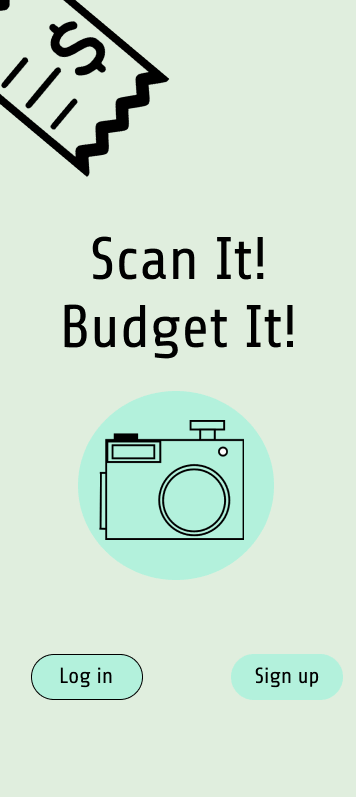
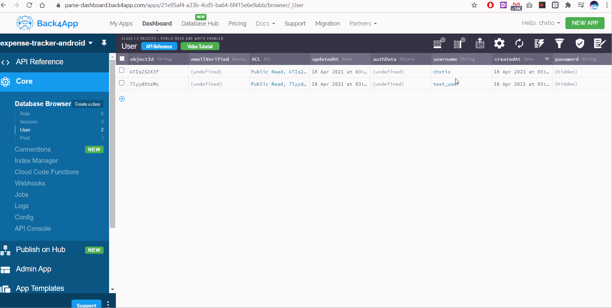

# Expense-Tracker-Android (temp)

## Table of Contents
1. [Overview](#Overview)
1. [Product Spec](#Product-Spec)
1. [Wireframes](#Wireframes)
2. [Schema](#Schema)

## Overview
### Description
This app will allow users to keep track of their own personal finances. This is done by taking pictures of receipts. Using text recognition, the app would analyze and extract transaction information from the receipt image. With this data, the user would be given various budgeting and financial information (i.e. charts, graphs, and statistics) to help visualize their spending habits.

### App Evaluation
[Evaluation of your app across the following attributes]
- **Category:** Personal Finance/budgetting
- **Mobile:** This app would be primarily developed for mobile (Android) but can potentially sync with a google spreadsheet, another mobile/web app, or our own web companion app.
- **Story:** Allows user to take a picture of their receipts in case they want to make a return or check the expense tracking report to better manage their budget goals.
- **Market:** Adults 18+
- **Habit:** Daily use
- **Scope:** 

## Product Spec

Sprint 1: Set up backend
- [x] Deploy Parse server with Back4App
- [x] Set up Parse Login

GIF created with [LiceCap](http://www.cockos.com/licecap/).

Sprint 2: Image capture and text recognition
- [x] Use Parse API to get data from database
- [x] Image capture functionality
- [x] Can properly submit image to Parse

Sprint 3
- [x] Style the UI
- [ ] Build out the app
- [x] Build the Parse backend
- [x] Add Firebase to project
- [ ] Use Google's ML Kit Text Recognition APIs to process the images

### 1. User Stories (Required and Optional)

**Required Must-have Stories**

* User can sign up to create an account using Parse authentication
* User can log in and out of account (session is persisted)
* Image capture- User can take takes a picture of their receipts
* Image recognition- Uses OCR (Optical Character Recognition) to parse text fields
* Spending habit data visualization
* User should switch between tabs- view spending habit report, view saved receipts and camera button to take photos

**Optional Nice-to-have Stories**

* Add ability to edit receipt before submitting
* Train a machine learning model to classify personal, business expense, food, and other categories

### 2. Screen Archetypes

* [list first screen here]
   * [list associated required story here]
   * ...
* [list second screen here]
   * [list associated required story here]
   * ...

### 3. Navigation

**Tab Navigation** (Tab to Screen)

* View receipts (with small camera icon)
* Capture new image
* Profile/Settings
* View report

**Flow Navigation** (Screen to Screen)

* Login
   * View receipts
* View receipts
   * List Receipts
       * Individual receipt information
   * Capture new receipt image
* Profile
    * User settings
* Budget Report
    * Graph/chat view

## Wireframes
[Add picture of your hand sketched wireframes in this section]

### [BONUS] Digital Wireframes & Mockups

### [BONUS] Interactive Prototype

## Schema 
[This section will be completed in Unit 9]
### Models

| Property | Type | Description |
| -------- | ---- | ----------- |
| objectId | string | unique id for the user post (default field) |
| password | string | password of current user |
| author | Pointer to User | image author |
| receiptImage | image | image of receipt |
| storeName | string | name of store where transaction was made |
| category | string | transaction category |
| totalCost | double | total cost of transaction |
| createdAt | DateTime | date when post is created (default field) |

### Networking
- [Add list of network requests by screen ]
- [Create basic snippets for each Parse network request]
- [OPTIONAL: List endpoints if using existing API such as Yelp]

### Build Sprint 1

### Build Sprint 2

